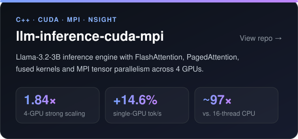
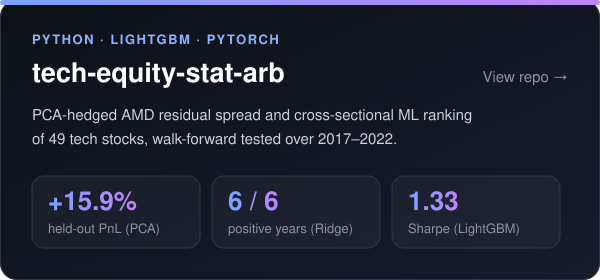

  

  
  
  

### About me

- I build **LLM systems**: retrieval and reranking, agents, and fast GPU inference.
- **Google SWE Intern (Summer 2026):** fine-tuned a Gemma cross-encoder reranker with JAX + FSDP on TPU. Recall@5 went from 0.80 to **0.94**, and reranking takes **1.2 s** versus more than 30 s for LLM rerankers.
- **Research:** I compress neural networks by replacing whole NN / ViT layers with explicit **symbolic and PDE expressions** found by genetic programming.
- **Background:** math (Renmin University) and quantitative research (A-share factor and portfolio work).

### Featured projects

<table>
  <tr>
    <td width="50%"></td>
    <td width="50%"></td>
  </tr>
</table>

### Experience

| | Role | When | Highlights |
|---|---|---|---|
| **Google** | Software Engineer Intern | Jun – Sep 2026 | Skill-retrieval benchmark (150 skills); fine-tuned Gemma reranker (Recall@5 0.80 → 0.94); +30% gold-skill activation in an internal LLM agent |
| **ICBC UBS Asset Management** | Quant Research Intern | Oct 2024 – Jan 2025 | LightGBM stock ranking (Rank IC 0.11); CSI 500 enhanced portfolio, +5.7% annual excess return (IR 0.97) |
| **Tianfeng Securities** | Quant Research Intern | Jul – Sep 2023 | Price-conditioned amplitude factor, 1.87 long–short Sharpe (2014–2023) |

### Publications

- **SymRefine: A Symbolic Regression Approach for Refining and Compressing Neural Networks** 
  Wei Wei, Qiang Lu, **Can Huang**, David Lee, Jake Luo · *Neurocomputing*, 2026
  
- **Refining Neural Network with Symbolic Regression** 
  Wei Wei, Qiang Lu, **Can Huang**, Jake Luo · *GECCO '25 Companion*, pp. 923–926
  

<b>Under review</b> (2)

 

- *Refining Vision Transformer with PDE Discovered by Symbolic Regression* (TPAMI)
- *ResPDE-SR: Evolving Residual PDE Symbolic Regression for Refining CNN* (AAAI 2027)

### Toolbox

  
  
  
  
  
  
  
  
  

  
  
  
  
  
  
  

